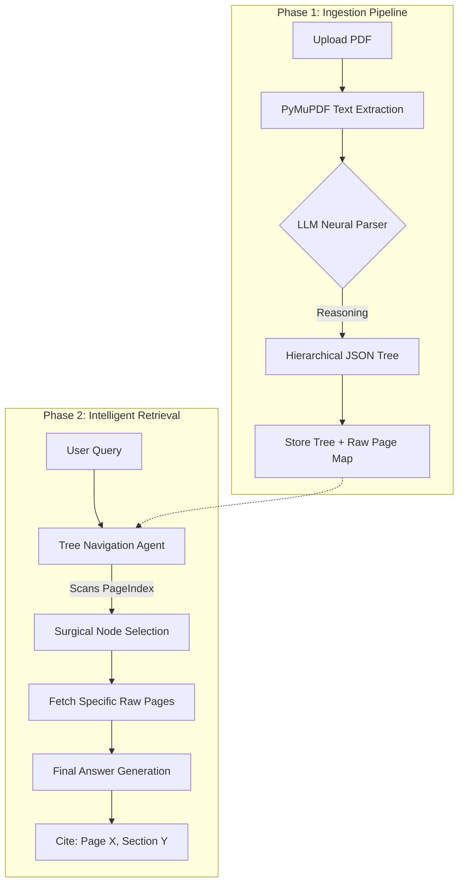

# Vectorless RAG: The PageIndex Revolution

[](https://www.python.org/)
[](https://fastapi.tiangolo.com/)
[](https://reactjs.org/)
[](https://threejs.org/)

A high-performance, deterministic alternative to traditional Vector RAG that eliminates chunking pipelines and vector databases in favor of a **Hierarchical PageIndex Architecture**.

---

## 🌟 The Need for Vectorless RAG

Traditional Retrieval-Augmented Generation (RAG) is fundamentally flawed by its reliance on **Vector Similarity**. 
- **The "Confetti" Problem**: Vector RAG breaks documents into arbitrary chunks. When you ask a question, it retrieves a "handful of confetti" (unrelated fragments), often losing the logical flow of the author.
- **The Context Gap**: Mathematical similarity does not equal semantic intent. Vector RAG can find a sentence that *looks* like your question but has zero relevance to the *answer*.
- **Infrastructure Bloat**: Setting up Pinecone, Chroma, or Milvus just to read a few PDFs is like building a skyscraper to store a notebook.

**Vectorless RAG** solves this by preserving the document's original DNA—its hierarchy. It navigates a document exactly like a human: by reading the Table of Contents (The PageIndex) and jumping to the exact page.

---

## 🔥 Comparison: Vector RAG vs. Vectorless RAG (PageIndex)

| Feature | Simple RAG (Vector) | Vectorless RAG (PageIndex) |
| :--- | :--- | :--- |
| **Indexing Method** | Math-based Chunking | Semantic Hierarchy Mapping |
| **Data Storage** | Heavy Vector Database | Light JSON PageIndex |
| **Retrieval Accuracy** | Probabilistic (Top-K similarity) | Deterministic (Surgical Intent) |
| **Traceability** | Fragmented & Hard to verify | Full Page & Section Citations |
| **Setup Complexity** | High (Embeddings, DBs, Pipelines) | Low (Pure Python + LLM Reasoning) |
| **Cross-Referencing** | Impossible | Agentic (Can follow internal links) |

---

## 🏗️ The Internal Pipeline (Data Flow)



### 1. The Neural Parser
Instead of blindly cutting text, our parser reads the document to identify "Semantic Anchors." It builds a tree where every node contains a `node_id`, a `summary`, and a `page_range`. This preserves the logical relationship between a header and its sub-points.

### 2. The Navigation Agent
When you query, the agent doesn't search for "words." It scans the **summaries** of the tree nodes to understand which chapter or section *intends* to answer the query. It then retrieves only the raw, unedited pages from that specific section.

---

## 💰 Real-World Financial Impact & Savings

In a production environment, Vectorless RAG provides massive cost efficiencies:
1. **Zero Vector DB Costs**: No monthly subscription for Pinecone or managed vector services.
2. **Embedding API Savings**: Traditional RAG charges for every single chunk indexed. Vectorless RAG runs **one** indexing prompt for the entire document (~1-3k tokens), saving up to 90% in ingestion costs.
3. **Context Window Efficiency**: Instead of stuffing 20 irrelevant chunks into the context (wasting tokens), we inject 2-3 perfectly relevant pages.
4. **Maintenance**: No need for "re-indexing" or "re-ranking" logic. The PageIndex is static and permanent.

---

## 🛡️ "Tank-Proof" LLM Failover System

This project is built for 100% uptime using a multi-cloud failover strategy.

### 🔄 The Switching Logic:
1. **Primary**: **Groq (Llama-3.3-70b-versatile)**
   - *Why?* It is the fastest LLM on the planet, providing near-instant responses.
2. **Priority 2**: **Groq (Llama-3.1-8b-instant)**
   - *Why?* If the 70B model hits a rate limit, the 8B model has massive capacity and handles traffic spikes effortlessly.
3. **Priority 3**: **Google Gemini (2.5-Flash / 2.0-Flash)**
   - *Why?* If Groq's entire API is down, the system jumps to Google's infrastructure.
   - *Note*: The system uses your confirmed available models (v2.0/v2.5) to avoid 404 errors.

### ⚠️ Smart Backoff:
If any model returns a **429 (Rate Limit)** or **503 (Overloaded)**, the system **waits** (2s, 4s, 6s...) and retries up to 5 times before failing over. This ensures your data processing never stops.

---

## 🚀 Setup and Run

### 1. Clone the Repository
```bash
git clone https://github.com/siddharthth5135/RAG_PageIndex.git
cd RAG_PageIndex
```

### 2. Configure Environment
Create a `.env` file in the root:
```env
GROQ_API_KEY=your_groq_key
GEMINI_API_KEY=your_gemini_key

# Optional for Graph Persistence
NEO4J_URI=bolt://localhost:7687
NEO4J_USER=neo4j
NEO4J_PASSWORD=password
```

### 3. Start the Backend
```bash
# Recommended: Create a virtual environment
python -m venv venv
source venv/bin/activate # Windows: venv\Scripts\activate

pip install fastapi uvicorn litellm pypdf python-dotenv google-generativeai requests
python fastapi_server.py
```

### 4. Start the Frontend
```bash
cd frontend
npm install
npm run dev
```
Open [http://localhost:5173](http://localhost:5173) in your browser.

---

## 🎨 Professional Visuals
The frontend features a **Three.js powered 3D Hierarchical Visualizer**. As the backend parses your document, you see the "Neural Connections" forming in real-time, mapping out the DNA of your PDF.

---

## 🛠️ Models Used
- **Intelligence**: Meta Llama 3.3 70B (Via Groq Cloud)
- **High-Throughput**: Meta Llama 3.1 8B (Via Groq Cloud)
- **Failover Context**: Google Gemini 2.5 Flash / 2.0 Flash

---

## 👤 Credits
Created as a professional-grade demonstration of **Vectorless Retrieval Architectures**.
Developed by **Siddharth**.
