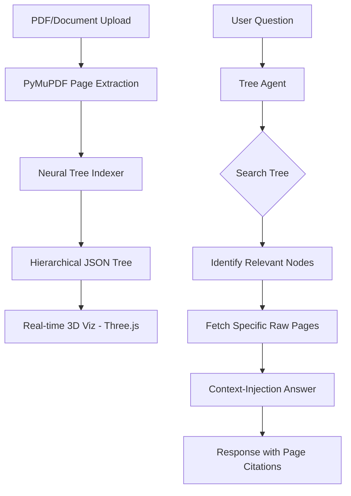

# 🚀 Vectorless RAG: PageIndex Architecture

[](https://fastapi.tiangolo.com/)
[](https://reactjs.org/)
[](https://threejs.org/)
[](https://github.com/BerriAI/litellm)

A revolutionary, high-performance approach to Retrieval-Augmented Generation that **completely eliminates chunking pipelines and Vector Databases**. 

Traditional RAG is blind; it breaks documents into mathematical chunks and hopes for the best. **Vectorless RAG** parses documents into a hierarchical semantic tree, preserving the document's logical structure for surgical precision.

---

## 📑 Table of Contents
- [🔍 Why Vectorless RAG?](#-why-vectorless-rag)
- [📈 Advantages vs. Traditional RAG](#-advantages-vs-traditional-rag)
- [🧠 Multi-Model Intelligence (Failover Logic)](#-multi-model-intelligence-failover-logic)
- [💰 Real-World Financial Impact](#-real-world-financial-impact)
- [🏗️ Technical Architecture](#️-technical-architecture)
- [🛠️ Tech Stack](#️-tech-stack)
- [🚀 Setup & Installation](#-setup--installation)

---

## 🔍 Why Vectorless RAG?

In traditional RAG, documents are sliced into arbitrary chunks (e.g., 500 tokens). This leads to:
- **Lost Context**: A sentence in a chunk might refer to a table 10 pages away.
- **Black Box Retrieval**: Mathematical similarity (Cosine Similarity) doesn't understand "intent."
- **Infrastructure Overload**: Managing Vector DBs like Pinecone, Milvus, or Chroma adds cost and complexity.

**Vectorless RAG** treats a document like a human does: it builds a **Table of Contents (Neural Tree Index)** first, and then agentically navigates to the exact pages needed to answer a query.

---

## 📈 Advantages vs. Traditional RAG

| Feature | Traditional Vector RAG | Vectorless RAG (PageIndex) |
| :--- | :--- | :--- |
| **Data Structure** | Unordered Vector Chunks | Hierarchical JSON Tree |
| **Context Retention** | Poor (Chunks are isolated) | Perfect (Full pages retrieved) |
| **Search Method** | Nearest Neighbor (Math) | Semantic Navigation (Reasoning) |
| **Infrastructure** | Vector DB + Embedding Models | Simple JSON Logs |
| **Accuracy** | Hit or Miss (Top-K) | High (Surgical Intent-based) |
| **Citations** | Difficult/Approximated | Exact (Section + Page Number) |

---

## 🧠 Multi-Model Intelligence (Failover Logic)

This project features a **Professional-Grade LLM Orchestration** layer using LiteLLM. 

### Dual-Engine Resilience:
- **Primary Engine**: **Groq (Llama-3.3-70b)** — Chosen for its insane speed (300+ tokens/sec) to build indices and query results in real-time.
- **Secondary Engine**: **Google Gemini 1.5 Flash** — High reliability and massive context window.

### Intelligent Switching Logic:
1. **The Lead**: System always attempts to use **Groq** first for maximum performance.
2. **Auto-Failover**: If Groq hits a rate limit (`429`) or is unavailable, the system **internally and instantly switches** to **Gemini**.
3. **Consensus Retrieval**: If both are available, the system can be configured to use the most cost-effective path depending on the token count of the document.

---

## 💰 Real-World Financial Impact

**Vectorless RAG is designed to save money in production environments:**

1. **Zero Vector DB Costs**: No monthly subscriptions for Pinecone or managed Weaviate. The "database" is local JSON.
2. **Reduced Embedding API Bills**: Traditional RAG requires embedding every chunk. For a 1000-page document, this costs dollars. In Vectorless RAG, we only run the LLM once to index.
3. **Smarter Token Usage**: Instead of stuffing 10 different "relevant" chunks into a prompt, we inject 2-3 specific pages. This keeps your query token count low and your LLM bills even lower.

---

## 🏗️ Technical Architecture



---

## 🛠️ Tech Stack

- **Backend**: Python 3.10+, FastAPI, Uvicorn.
- **Frontend**: Vite, React, Three.js (3D Graph), GSAP (Animations).
- **LLM Layer**: LiteLLM (Groq, Gemini, Ollama support).
- **Parsing**: PyMuPDF (High-speed document reading).

---

## 🚀 Setup & Installation

### 1. Clone the Repository
```bash
git clone https://github.com/siddharthth5135/RAG_PageIndex.git
cd RAG_PageIndex
```

### 2. Environment Configuration
Create a `.env` file in the root directory:
```env
GROQ_API_KEY=your_groq_key
GEMINI_API_KEY=your_gemini_key
```

### 3. Backend Setup
```bash
# It is recommended to use a virtual environment
python -m venv .venv
source .venv/bin/activate  # Windows: .venv\Scripts\activate

pip install -r requirements.txt
python fastapi_server.py
```

### 4. Frontend Setup
```bash
cd frontend
npm install
npm run dev
```

### 5. Deployment
To run the production-ready build:
```bash
cd frontend
npm run build
cd ..
python fastapi_server.py
```
Access the dashboard at `http://localhost:8000`.

---

## 🛡️ License
Distributed under the MIT License. See `LICENSE` for more information.

---
*Built with ❤️ for the future of Context-Aware AI.*
